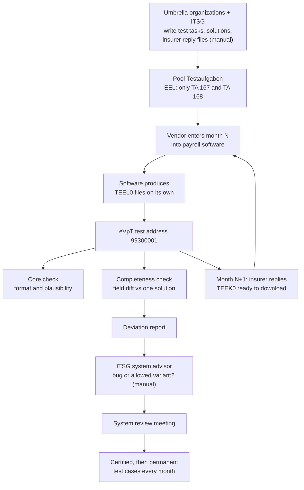

# Ecosystem today: how certification works without us

```mermaid
flowchart TD
    A["Umbrella organizations + ITSG<br/>write test tasks, solutions,<br/>insurer reply files (manual)"] --> B["Pool-Testaufgaben<br/>EEL: only TA 167 and TA 168"]
    B --> C["Vendor enters month N<br/>into payroll software"]
    C --> D["Software produces<br/>TEEL0 files on its own"]
    D --> E["eVpT test address 99300001"]
    E --> F["Core check<br/>format and plausibility"]
    E --> G["Completeness check<br/>field diff vs one solution"]
    G --> H["Deviation report"]
    H --> I["ITSG system advisor<br/>bug or allowed variant? (manual)"]
    E --> J["Month N+1: insurer replies<br/>TEEK0 ready to download"]
    J --> C
    I --> K["System review meeting"]
    K --> L["Certified, then permanent<br/>test cases every month"]
```

Manual steps: writing tests, solutions and replies (A), judging deviations (I).
