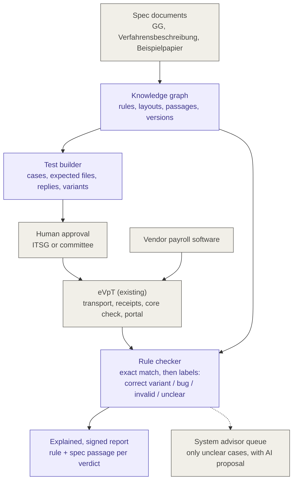

# System overview: the sandwich

```mermaid
flowchart TD
    S["Spec documents<br/>GG, Verfahrensbeschreibung, Beispielpapier"] --> KG["Knowledge graph<br/>rules, layouts, passages, versions"]
    KG --> TB["Test builder<br/>cases, expected files, replies, variants"]
    TB --> HA["Human approval<br/>ITSG or committee"]
    HA --> EV["eVpT (existing)<br/>transport, receipts, core check, portal"]
    V["Vendor payroll software"] --> EV
    EV --> RC["Rule checker<br/>exact match, then labels:<br/>correct variant / bug / invalid / unclear"]
    KG --> RC
    RC --> R["Explained, signed report<br/>rule + spec passage per verdict"]
    RC -.-> RV["System advisor queue<br/>only unclear cases, with AI proposal"]

    classDef ours fill:#EEEDFE,stroke:#534AB7,color:#3C3489
    classDef ext fill:#F1EFE8,stroke:#5F5E5A,color:#444441
    class KG,TB,RC,R ours
    class S,HA,EV,V,RV ext
```

Purple: built by us. Gray: existing or external.
Future (not in prototype): the vendor runs the rule checker locally before uploading.
