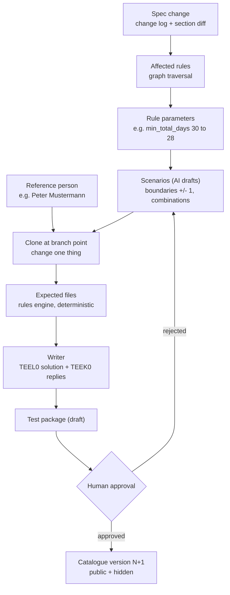

# Test builder flow

```mermaid
flowchart TD
    C["Spec change<br/>change log + section diff"] --> AR["Affected rules<br/>graph traversal"]
    AR --> P["Rule parameters<br/>e.g. min_total_days 30 to 28"]
    P --> SC["Scenarios (AI drafts)<br/>boundaries +/- 1, combinations"]
    BASE["Reference person<br/>e.g. Peter Mustermann"] --> CL["Clone at branch point<br/>change one thing"]
    SC --> CL
    CL --> EX["Expected files<br/>rules engine, deterministic"]
    EX --> W["Writer<br/>TEEL0 solution + TEEK0 replies"]
    W --> PK["Test package (draft)"]
    PK --> HA{"Human approval"}
    HA -->|approved| CAT["Catalogue version N+1<br/>public + hidden"]
    HA -->|rejected| SC
```

The LLM never computes expected values. It drafts scenarios and story text only.
