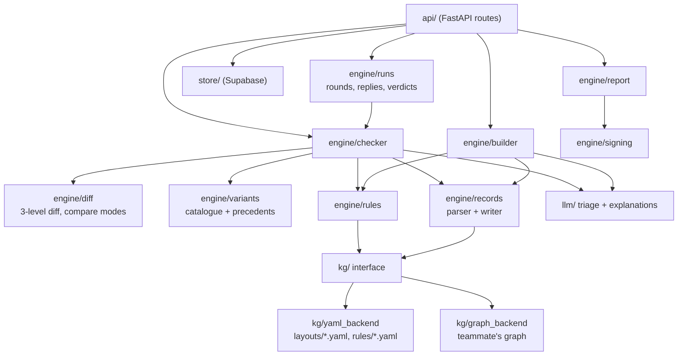

# Backend components and dependencies

```mermaid
flowchart TD
    API["api/ (FastAPI routes)"] --> CHK["engine/checker"]
    API --> BLD["engine/builder"]
    API --> REP["engine/report"]
    API --> DB["store/ (Supabase)"]
    CHK --> DF["engine/diff<br/>3-level diff, compare modes"]
    CHK --> VC["engine/variants<br/>catalogue + precedents"]
    API --> RUN["engine/runs<br/>rounds, replies, verdicts"]
    RUN --> CHK
    CHK --> PAR["engine/records<br/>parser + writer"]
    CHK --> RUL["engine/rules"]
    CHK --> LLM["llm/ triage + explanations"]
    BLD --> RUL
    BLD --> PAR
    BLD --> LLM
    RUL --> KGI["kg/ interface"]
    PAR --> KGI
    KGI --> KGY["kg/yaml_backend<br/>layouts/*.yaml, rules/*.yaml"]
    KGI --> KGG["kg/graph_backend<br/>teammate's graph"]
    REP --> SIG["engine/signing"]
```

Rule: only `kg/` knows where layouts and rules come from. Switching from YAML to the real graph changes one config value.
