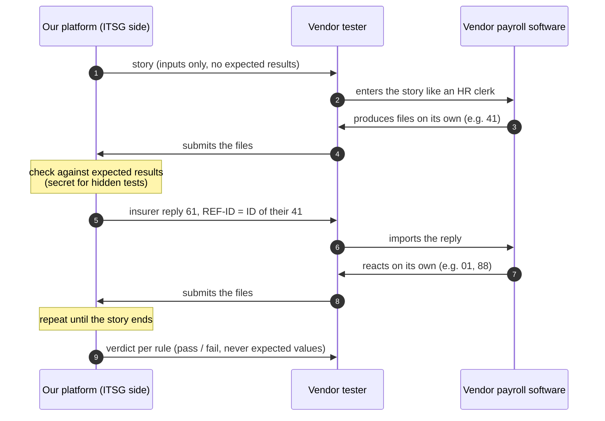

# How a test runs in rounds (public or hidden)

```mermaid
sequenceDiagram
    autonumber
    participant US as Our platform (ITSG side)
    participant V as Vendor tester
    participant SW as Vendor payroll software
    US->>V: story (inputs only, no expected results)
    V->>SW: enters the story like an HR clerk
    SW->>V: produces files on its own (e.g. 41)
    V->>US: submits the files
    Note over US: check against expected results<br/>(secret for hidden tests)
    US->>V: insurer reply 61, REF-ID = ID of their 41
    V->>SW: imports the reply
    SW->>V: reacts on its own (e.g. 01, 88)
    V->>US: submits the files
    Note over US: repeat until the story ends
    US->>V: verdict per rule (pass / fail, never expected values)
```

Peter's test: 4 rounds (41 / 01 / 88 + 01 / import 62). See `06_LIFECYCLE_AND_HIDDEN_TESTS.md`, section 5.
